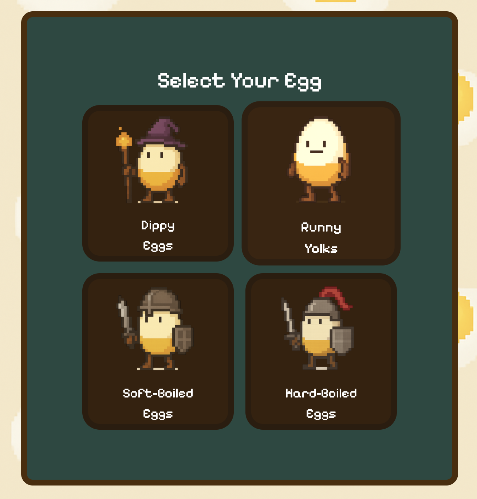
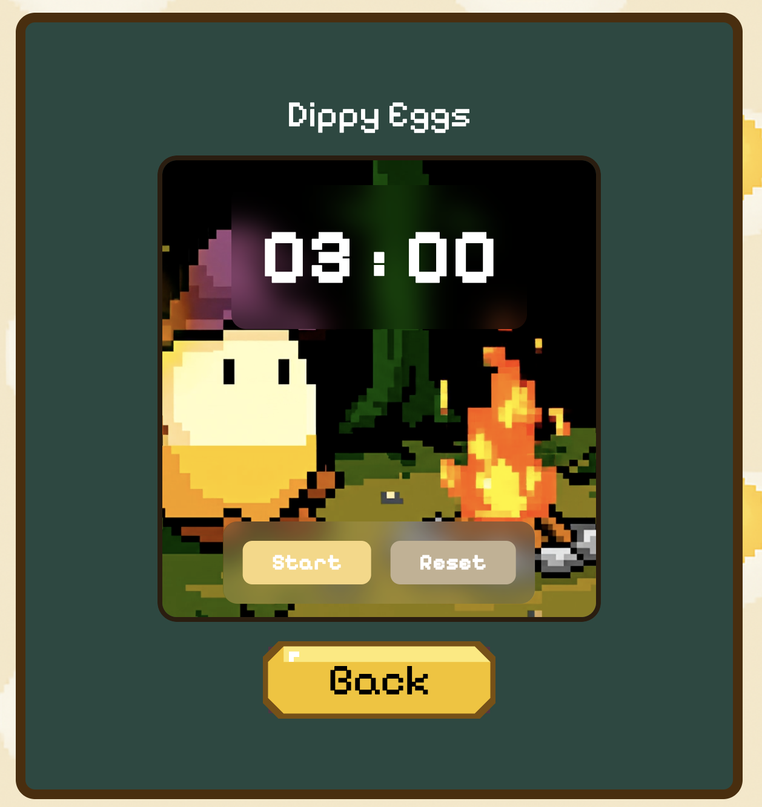
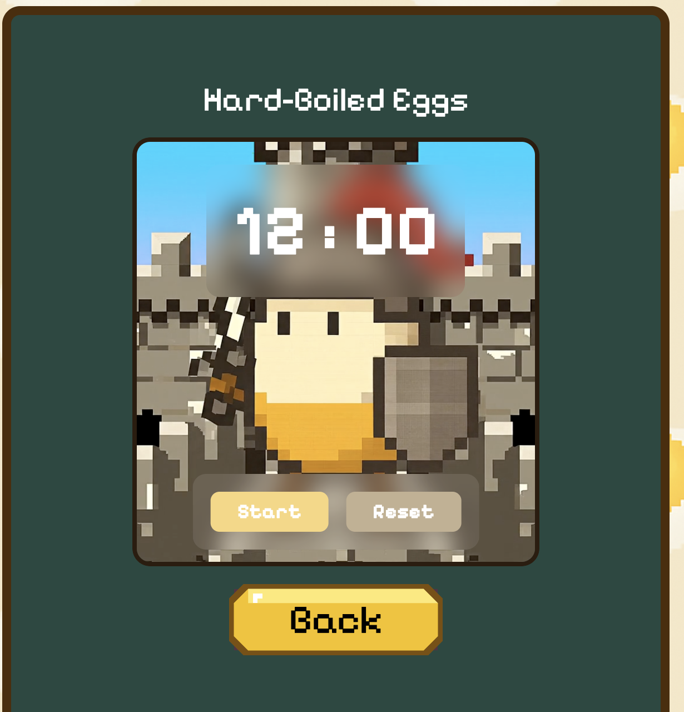

# 🥚 Eggify - Boil Eggs Like a Pro!

Eggify is a playful and pixel-styled timer app for perfectly boiling eggs!  
Choose your egg style (Dippy, Runny, Soft-Boiled, or Hard-Boiled) and let the timers + animations guide your breakfast to perfection.


---

## 🚀 Features

- 🍳 **4 Unique Timers** – Dippy, Runny, Soft-Boiled, Hard-Boiled
- 🎞️ **Animated Backgrounds** – Immersive looping videos for each egg type
- 🎨 **Pixel UI** – Retro-style fonts, button sprites, and UI details
- 📱 **Fully Responsive** – Works great on mobile and desktop
- 🌙 **Relaxed Mode** – Minimal design to keep mornings stress-free

---

## 📸 Screenshots

| Egg Menu | Dippy Timer | Hard-Boiled |
|---------|--------------|--------------|
|  |  |  |

---

## 🧰 Built With

- **React + Vite**
- **Tailwind CSS**
- **Framer Motion**
- **HTML5 Video**

---

## 🛠️ Setup

```bash
# Clone the repo
git clone https://github.com/yourusername/Eggify.git
cd Eggify

# Install dependencies
npm install

# Start the dev server
npm run dev
